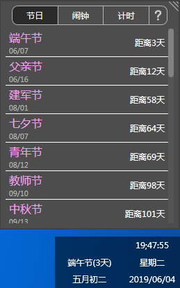

# desktopDate

[https://github.com/xxxxst/desktopDate](https://github.com/xxxxst/desktopDate)

有多个显示屏时，在右下角显示更多日期、节日

- 显示时间、农历日期、星期
- 节日倒计时
- 闹钟
- 定时器

---

## 环境

.net framework 4.5 or high

## 编程语言

C# | WPF

` `

---

## 依赖
- WindowsAPICodePack
- Fody
- fmod

## license

[GPL-3.0 - LICENSE.txt](./LICENSE.txt)

[fmod license - https://www.fmod.com/licensing](https://www.fmod.com/licensing)
